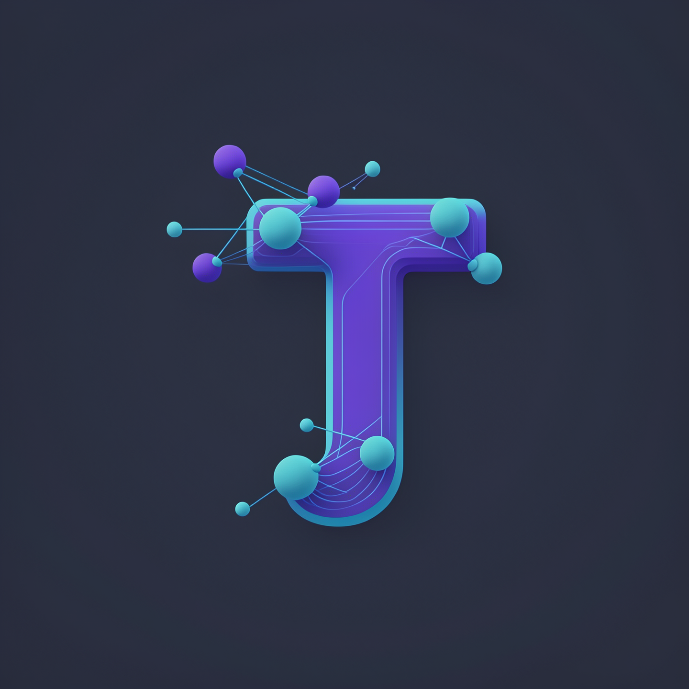
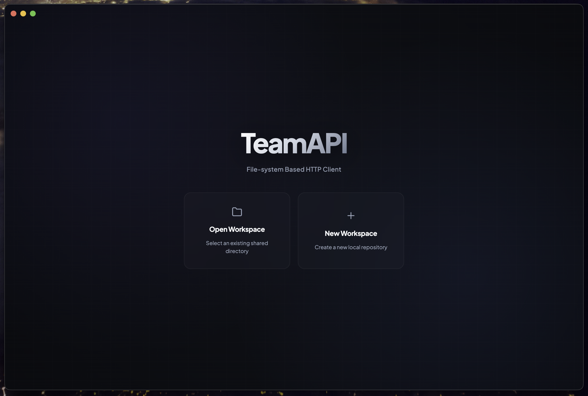
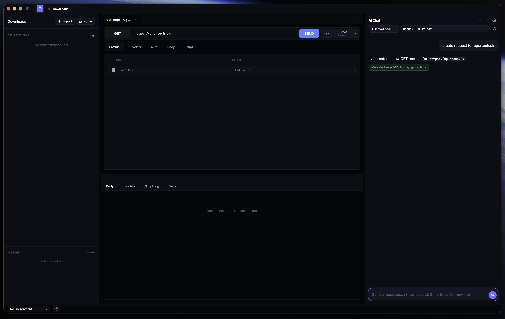

<p align="center">
  
</p>

<h1 align="center">Team API</h1>

<p align="center">
  A file-system-based HTTP client with a built-in, context-aware AI assistant.<br/>
  Local-first. Multi-provider. No cloud, no lock-in.
</p>

<p align="center">
  <a href="https://github.com/halilugur/team-api"></a>
  <a href="./LICENSE"></a>
  
  
</p>

<br/>

<p align="center">
  
</p>

<p align="center"><em>Home — recent workspaces, create or open a project directory.</em></p>

<br/>

<p align="center">
  
</p>

<p align="center"><em>Workspace — collections &amp; history on the left, the request editor in the center, the AI assistant on the right.</em></p>

---

## Overview

**Team API** is a desktop HTTP client for designing, testing, and documenting APIs. Everything is stored as plain JSON on disk — collections, environments, and chat history — so your workspace is fully portable, scriptable, and version-controllable. No accounts, no sync servers, no proprietary database.

On top of the request engine sits an **AI assistant** that can see your active request and response, answer questions about them, and even **edit or create requests** for you.

## Highlights

**Request building**
- Multi-tab editor — work on several requests at once.
- All HTTP methods, query params, headers, and body types (JSON / text / XML / HTML / JS / form / URL-encoded / GraphQL).
- Auth: None, Bearer, Basic, API Key — per request.
- `{{variable}}` interpolation everywhere, with **live preview** of the resolved value as you type.
- URL ↔ Params two-way sync.
- Sandboxed **HTML response preview**, plus Pretty / Raw views and full-text response search.
- One-click **code snippets**: cURL, Fetch, Axios, Python `requests`, Go, Java `HttpClient`.
- Pre & post-request scripts with a Postman-style `pm` API (set variables, run assertions).

**File-system workspaces**
- Collections, folders, and environments are human-readable `.json` files.
- Edit them in any editor, commit them to git, or generate them with scripts.
- Import existing work from **Postman** and **OpenAPI** specs.

**AI assistant** (see below)
- Multi-provider, streaming, and able to modify the request you're working on.

**Productivity**
- Folders and right-click context menus (rename, duplicate, delete).
- Persistent error toasts with copy-to-clipboard.
- Cross-platform builds: macOS (DMG), Windows (NSIS / MSI / ZIP), Linux (AppImage).

## AI Assistant

The right-hand panel is an assistant that lives inside your workspace. It is **context-aware**: every message includes a snapshot of the active request (method, URL, headers, body, auth) and the last response, so it can reason about what you're doing — not answer generically.

It streams responses token-by-token and renders markdown (headings, lists, code blocks, links). More importantly, it can **act** on the request through a simple action protocol — for example:

> **You:** *"add an Authorization header with value Bearer secret and run it"*
> **Assistant:** adds the header, then sends the request. A green "✓ Applied" chip confirms what changed.

Supported actions: create a new request, set method / URL, add or remove headers & params, set the body, set auth, and execute the request.

### Supported providers

| Provider | Notes |
| --- | --- |
| **Ollama** (default) | Local, no API key required. |
| **OpenAI** | GPT-4o / 4.1 / o-series. |
| **OpenAI-Compatible** | Any `/chat/completions` endpoint — Groq, OpenRouter, DeepSeek, LM Studio, vLLM… (optional API key). |
| **Claude (Anthropic)** | Sonnet 4.6 / Opus 4.8 / Haiku 4.5 / Fable 5. |
| **Gemini (Google)** | Gemini 2.x / 1.5. |

Provider API keys are stored in the app's **global user data** (never written into the shared workspace folder). Conversations are saved per-workspace under `.teamapi/chats/`.

## Getting started

### Prerequisites
- [Node.js](https://nodejs.org) **v18+**
- npm (bundled with Node.js)

### Install & run
```bash
git clone https://github.com/halilugur/team-api.git
cd team-api
npm install
npm start
```

On first launch, create or open a workspace directory — that folder becomes your project. Use the **⚙** button in the AI panel to configure a provider, then start chatting.

## Building installers

Production builds are handled by `electron-builder`. For a quick unpacked build:

```bash
npm run pack
```

For a platform installer, either:

```bash
npm run dist      # uses electron-builder directly
# or
./release.sh      # detects your OS and picks sensible targets
```

`release.sh` auto-detects the operating system and, on macOS, skips the `.msi` target to avoid the WiX/Wine requirement.

**Output formats**
- **macOS** — DMG
- **Linux** — AppImage
- **Windows** — NSIS setup EXE, portable ZIP, MSI (MSI requires a Windows build environment)

Build targets are configured in [`package.json`](./package.json) under `build`.

## Workspace structure

```
my-workspace/
├── collections/        # one .json per collection (requests + folders)
├── environments/       # one .json per environment (variables + secrets)
└── .teamapi/
    ├── meta.json       # workspace metadata
    ├── history.json    # recent request history
    └── chats/          # saved AI conversations
```

Because it's just files, you can commit the whole workspace to git and collaborate naturally — or ignore `.teamapi/` if you'd rather keep history and chats local.

## Tech stack

- **Electron 42** — cross-platform desktop shell
- **Vanilla JavaScript** — no UI framework, no build step for the renderer
- **Axios** — HTTP engine (requests run in the main process, so there are no CORS limits)
- **uuid** — identifiers

## Keyboard shortcuts

| Action | Shortcut |
| --- | --- |
| Toggle sidebar | `Ctrl/Cmd` + `\` |
| Toggle AI assistant | `Ctrl/Cmd` + `]` |
| Go to Home | `Ctrl/Cmd` + `Shift` + `H` |
| Send chat message | `Enter` (newline: `Shift` + `Enter`) |

## License

[Apache-2.0](./LICENSE) © Halil Uğur
